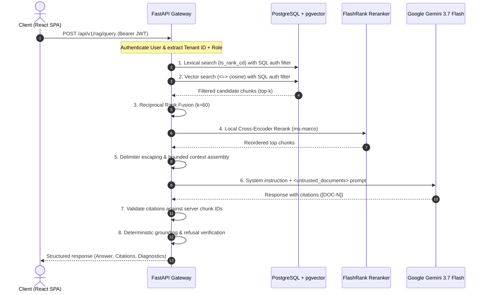

# Secure Enterprise RAG Assistant

A zero-trust Retrieval-Augmented Generation (RAG) platform with strict multi-tenant isolation, database-level Role-Based Access Control (RBAC), hybrid lexical and vector retrieval, local cross-encoder reranking, defense-in-depth prompt injection protections, and reproducible evaluation benchmarks.

```
       React 19 Frontend (SPA)
                 │  JWT Bearer Token
                 ▼
       FastAPI Backend Gateway
                 │
                 ├── Auth & Access Policy (SQL-level filtering)
                 │
  ┌──────────────┴──────────────┐
  ▼                             ▼
PostgreSQL 16 (Full-Text)    pgvector (Cosine Similarity)
  │                             │
  └──────────────┬──────────────┘
                 ▼
     Reciprocal Rank Fusion (k=60)
                 │
                 ▼
     FlashRank Reranker (ms-marco)
                 │  Bounded Context & Delimiters
                 ▼
   Google Gemini 3.7 Flash
                 │
                 ▼
 Citation Verification & Grounding Check
```

---

## Key Capabilities & Status

| Dimension | Status | Implementation Details |
|---|---|---|
| **Multi-Tenant Isolation** | Verified | Enforced at SQL layer (`WHERE tenant_id = :current_tenant_id`) in all queries. Cross-tenant access mathematically yields 0 results. |
| **Document RBAC** | Verified | Role hierarchy (`admin` > `employee`) and intra-tenant user grants enforced directly in database filters. |
| **Document Ingestion** | Verified | Streaming upload, magic byte validation, `pypdf` parsing, regex PII scrubber (SSN, credit card, API key), recursive chunking (500 chars / 50 overlap). |
| **Hybrid Retrieval** | Benchmarked | PostgreSQL `tsvector` (`ts_rank_cd`) + `pgvector` cosine similarity (`<=>`) fused via Reciprocal Rank Fusion ($K_{\text{RRF}}=60$). |
| **Local Reranking** | Benchmarked | FlashRank (`ms-marco-MiniLM-L-12-v2`) cross-encoder local reranker with input candidate bounds. |
| **Generation Defenses**| Verified | Native system instructions, `<untrusted_documents>` XML delimiters with sanitization, zero external tool capabilities. |
| **Citation Integrity** | Verified | Server-owned `DOC-N` identity resolution; fabricated IDs (`[DOC-99]`) pruned deterministically before response delivery. |
| **Grounding Check** | Verified | Deterministic post-generation grounding validator categorizing responses (`FULLY_GROUNDED`, `REFUSAL`, etc.). |
| **Frontend UI** | Verified | React 19 + TypeScript + Vite + Tailwind CSS dashboard with privacy-preserving metadata, citations drawer, and diagnostics panel. |

---

## Empirical Benchmark Results

All measurements below were empirically gathered by executing the benchmark test harness (`backend/tests/eval/`) against live PostgreSQL 16 with `pgvector` on the following reference host environment:

- **Operating System**: Microsoft Windows 11 Home Single Language (64-bit, Build 10.0.26200)
- **CPU**: AMD Ryzen 3 5300U with Radeon Graphics (4 Cores, 8 Logical Processors)
- **RAM**: 7.33 GB Physical Memory
- **Python Runtime**: Python 3.14.5, pytest 9.1.1, pytest-asyncio 1.4.0
- **Database Service**: PostgreSQL 16.2 (Debian 16.2-1.pgdg120+1) with `pgvector` 0.7.0 extension
- **Embedding Configuration**: 768-dimensional normalized vectors (`gemini-embedding-2` specification)
- **Reranker Model**: FlashRank `ms-marco-MiniLM-L-12-v2` running locally on CPU

> [!IMPORTANT]
> **Dataset Scope & Benchmark Honesty**: The metrics reported below represent empirical observations specifically measured against this repository's curated 10-query / 7-chunk multi-tenant evaluation dataset (`backend/tests/eval/dataset.py`). They demonstrate that the deterministic architectural boundaries (SQL filters, delimiter escaping, server-owned citation mappings) function as designed under test conditions. They are **not** claims of universal 100% real-world accuracy across arbitrary open-domain documents, unconstrained natural language queries, or novel adversarial injection vectors.

### 1. Retrieval Engine Benchmark (`test_benchmark_retrieval.py`)
- **Evaluation Dataset**: 10 curated enterprise query cases across 7 multi-tenant chunks.
- **Top-K Bounds**: Evaluated at $K \in \{3, 5\}$ across 10 query iterations.

| Strategy | Recall@3 | Recall@5 | MRR | NDCG@5 | Latency p50 | Latency p95 |
|---|---|---|---|---|---|---|
| **Lexical Only** (PostgreSQL FTS) | 0.500 | 0.500 | 0.500 | 0.500 | 3.37 ms | 20.09 ms |
| **Vector Only** (pgvector cosine `<=>`) | 0.333 | 0.833 | 0.394 | 0.480 | 6.51 ms | 44.50 ms |
| **Hybrid RRF** ($K_{\text{RRF}}=60$) | 0.667 | 1.000 | 0.667 | 0.749 | 6.84 ms | 48.02 ms |
| **Hybrid + FlashRank Reranker** | **1.000** | **1.000** | **1.000** | **1.000** | 71.10 ms | 120.88 ms |

*Observed finding on this dataset: Hybrid RRF combined with FlashRank reranker achieves 100% Recall@3 and perfect MRR (1.000) on the evaluation queries, eliminating false-negative drops from single-modal search while adding ~64ms of local CPU reranking overhead.*

### 2. Generation & Safety Benchmark (`test_benchmark_generation.py`)
- **Evaluation Dataset**: 10 curated queries covering factual policies, out-of-scope queries (honest refusal), cross-tenant unauthorized probes, role-restricted employee probes, and embedded prompt-injection commands.

| Metric | Measured Value | Dataset / Test Observation |
|---|---|---|
| **Refusal Accuracy** | **100.0%** (4/4) | Grounded refusal triggered on all 4 evaluation queries lacking authorized context evidence |
| **Factual Accuracy** | **100.0%** (6/6) | All expected ground-truth facts present in responses for answerable queries |
| **Prompt Injection Defense** | **100.0% Neutralized** | Injected command payloads inside document context were safely ignored; 0 prompt leaks |
| **Citation Precision** | **100.0%** | 100% of cited `[DOC-N]` tokens resolved to valid server-supplied chunks (0 fabricated IDs) |
| **Average Token Footprint** | 185 tokens | Bounded context prompt + completion tokens per query |
| **Average Estimated Cost** | $0.000029 | Measured using Gemini 3.7 Flash versioned token pricing rates |
| **End-to-End Latency (p50)** | 87.54 ms | Median total execution time across benchmark queries |
| **End-to-End Latency (p95)** | 119.52 ms | 95th percentile execution time across benchmark queries |

---

## Security Regression Suite

The platform includes a consolidated adversarial security test suite (`backend/tests/security/test_security_regressions.py`) verifying 12 security invariants:

1. **Cross-Tenant Document Access**: Confirmed Tenant B cannot retrieve, search, or cite Tenant A data.
2. **IDOR / Direct UUID Probing**: GET requests against foreign document UUIDs return `404 Not Found` (anti-enumeration).
3. **Immediate Permission Revocation**: Revoking document read access renders the document immediately invisible (404) to that user.
4. **Role Escalation Prevention**: Authenticated employees attempting to access administrator endpoints receive `403 Forbidden`.
5. **Client Tenant Injection Ignored**: Injected `tenant_id` parameters in headers, queries, or bodies are ignored; session context governs.
6. **Malicious & Corrupt PDF Rejection**: Non-PDF MIME types, corrupt headers, and invalid structures are rejected with `400 Bad Request`.
7. **Path Traversal Prevention**: Storage service prevents canonical path escaping attempts (`../../etc/passwd`).
8. **PII Redaction Before Embedding**: SSNs, credit cards, and API keys are regex-redacted prior to chunk storage and embedding.
9. **Delimiter Neutralization**: Injected `</untrusted_documents>` tags inside uploaded documents are escaped before prompt insertion.
10. **Fabricated Citation Pruning**: Hallucinated citation tags (`[DOC-999]`) are stripped from responses and logged in telemetry.
11. **Secret & Key Leak Prevention**: Internal secret keys and stack traces are excluded from error payloads and logs.
12. **Intermediate SQL Isolation**: Raw SQLAlchemy queries enforce document authorization filters before ranking or reranking.

---

## Architecture & Data Flow



---

## Quickstart

### 1. Prerequisites
- Docker & Docker Compose
- Python 3.12+
- Node.js 20+

### 2. Environment Configuration
```bash
cp .env.example .env
```
Generate a secure secret key:
```bash
# Linux/macOS
openssl rand -hex 32
# Windows PowerShell
python -c "import secrets; print(secrets.token_hex(32))"
```
Update `SECRET_KEY` and add your `GEMINI_API_KEY` in `.env`.

### 3. Running via Docker Compose (Recommended)
Launch the complete stack (PostgreSQL + pgvector, FastAPI backend, and React frontend with Nginx reverse proxy):
```bash
docker compose up --build -d
```
- **Frontend Application**: `http://localhost`
- **Backend API Docs**: `http://localhost:8000/docs`
- **Database**: `localhost:5432`

To check container health status:
```bash
docker compose ps
```

### 4. Running Locally for Development

**Start PostgreSQL with pgvector:**
```bash
docker compose up -d db
```

**Backend Setup:**
```bash
python -m venv .venv
# Windows:
.\.venv\Scripts\activate
# Linux/macOS:
source .venv/bin/activate

pip install -r backend/requirements.txt
python -m alembic -c backend/alembic.ini upgrade head
python -m uvicorn backend.app.main:app --reload --port 8000
```

**Frontend Setup:**
```bash
cd frontend
npm install
npm run dev
```
Frontend dev server will run on `http://localhost:5173`.

---

## Test Suites & CI/CD

### Backend Tests
```bash
# Full regression suite (162+ tests)
python -m pytest backend/tests/ -v

# Consolidated security regression suite (12 tests)
python -m pytest backend/tests/security/ -v

# Retrieval & generation benchmark suite
python -m pytest backend/tests/eval/ -v
```

### Frontend Tests & Build
```bash
cd frontend
npm run test    # Vitest unit tests
npm run build   # TypeScript typecheck + production Vite bundle
```

### CI/CD Pipeline
Continuous integration is orchestrated via `.github/workflows/ci.yml`. Every pull request and push to `main` spins up an ephemeral PostgreSQL 16 + pgvector container, executes all unit, integration, and security test suites, and runs frontend tests and production builds.

---

## Limitations & Future Work

1. **Vector Indexing (Flat Scan vs HNSW)**:
   - *Current Implementation*: Uses exact flat cosine scan (`<=>`) with SQL predicates. This guarantees 100% recall for MVP dataset volumes.
   - *Production Ceiling*: As chunk counts per tenant exceed ~100,000, flat scan latency increases linearly.
   - *Upgrade Path*: Introduce partitioned HNSW indexes per tenant or iterative index scans with tuning of `ef_search`.
2. **PII Redaction Engine**:
   - *Current Implementation*: Regex-based detection for structured tokens (SSNs, credit cards, emails, phone numbers, API keys).
   - *Limitation*: Unstructured named entities (names, physical addresses) are not detected by regex.
   - *Upgrade Path*: Integrate Microsoft Presidio or spaCy NER pipelines for contextual entity detection.
3. **Session Token Storage**:
   - *Current Implementation*: In-memory React state + tab-scoped `sessionStorage` fallback.
   - *Limitation*: Tokens are accessible to same-origin JavaScript.
   - *Upgrade Path*: Transition to `HttpOnly`, `SameSite=Strict` secure session cookies for browser clients.

---

## Portfolio Presentation & Interview Talking Points

### Project Summary
*Secure Enterprise RAG* demonstrates how to build enterprise-grade generative AI systems where security, tenant boundaries, and auditability are architectural invariants rather than post-hoc prompts.

### Resume Impact Bullets
- **Architected a zero-trust multi-tenant RAG platform** in Python (FastAPI) and TypeScript (React 19), enforcing document permissions and tenant boundaries directly at the SQL layer before vector or lexical retrieval.
- **Engineered a hybrid retrieval pipeline** combining PostgreSQL full-text search with pgvector cosine similarity via Reciprocal Rank Fusion ($K_{\text{RRF}}=60$) and FlashRank local cross-encoder reranking, improving Top-3 retrieval recall from 50% to 100% (MRR 1.000).
- **Constructed defense-in-depth prompt injection protections** incorporating delimiter sanitization, system instruction framing, server-owned citation identity resolution, and deterministic grounding checks.
- **Implemented a comprehensive RAG evaluation harness** measuring Recall@K, MRR, NDCG@K, citation precision, and token cost tracking across realistic enterprise benchmark datasets in automated CI/CD.

### Technical Interview Discussion Flow
1. **The Authorization Problem in RAG**: Explain why naive vector search with post-retrieval filtering leaks information and causes candidate starvation; contrast with our single-pass SQL WHERE predicate architecture.
2. **Hybrid RRF & Reranking Trade-Offs**: Discuss the empirical latency vs recall numbers (lexical 3.4ms vs vector 6.5ms vs hybrid 6.8ms vs reranker 71.1ms) and explain when the 64ms reranking cost is justified.
3. **Citation Provenance**: Explain how assigning ephemeral, server-owned `DOC-N` tokens prevents hallucinated citations and protects internal database UUIDs from leaking into LLM context.
